# RCM Denial Management — System Architecture Diagram

## Mermaid Diagram (renders on GitHub)

```mermaid
%%{init: {'theme': 'base', 'themeVariables': {'primaryColor': '#1565C0', 'secondaryColor': '#E3F2FD', 'tertiaryColor': '#FFF3E0'}}}%%

flowchart TB
    subgraph INPUT["📥 Input Layer"]
        CSV["CSV Upload<br/>(Batch)"]
        WEBUI["NiceGUI Web UI<br/>(Interactive)"]
        FUTAPI["REST API<br/>(Future)"]:::future
    end

    subgraph PIPELINE["🤖 AI Pipeline (LangGraph StateGraph)"]
        direction TB

        subgraph INTAKE["1. Intake Agent"]
            IA["Validate & Parse<br/>ClaimRecord"]
        end

        subgraph ENRICH["2. Enrichment Agent (parallel asyncio.gather)"]
            direction LR
            PT["Patient<br/>Data Tool"]
            PP["Payer<br/>Policy Tool"]
            EHR_T["EHR<br/>Tool"]
            EOB["EOB OCR<br/>(PyMuPDF +<br/>Tesseract)"]
            SOP["SOP RAG<br/>Tool"]
        end

        subgraph ANALYSIS["3. Analysis Agent"]
            AA["LLM: Root Cause Analysis<br/>📝 Structured Prompt → DenialAnalysis<br/>🔄 Rule-based CARC Fallback"]
        end

        ROUTER{"Supervisor<br/>Router<br/>resubmit│appeal│both│write_off"}

        subgraph EVIDENCE["4. Evidence Check Agent"]
            EC["LLM Call 1: Evidence Sufficiency<br/>📝 Prompt: claim + enriched data + analysis<br/>→ EvidenceCheckResult<br/>💰 Cost tracked"]
        end

        subgraph TEHR["5. Targeted EHR Agent"]
            TE["Stage 2 Fetch:<br/>Labs, Imaging,<br/>Pathology"]
        end

        subgraph RESPONSE["6. Response Agent"]
            RA["LLM Call 2: Generate Response<br/>📝 Prompt: claim + evidence + SOP context<br/>→ CorrectionPlan + AppealLetter<br/>💰 Cost tracked"]
        end

        subgraph PACKAGE["7. Document Packaging Agent"]
            DP["PDF Generation (reportlab)<br/>Cover Letter + Analysis +<br/>Correction + Appeal<br/>→ Merged SUBMISSION_PACKAGE.pdf"]
        end

        subgraph REVIEWGATE["8. Review Gate Agent"]
            RG["Build AI Summary<br/>Enqueue for Human Review"]
        end
    end

    subgraph EXTERNAL["🔌 External Systems & Connection Registry"]
        direction TB

        subgraph EHR_SYS["EHR / EMR Systems"]
            EHR_MOCK["Mock<br/>(Active)"]
            EHR_EPIC["Epic FHIR R4<br/>REST API"]:::future
            EHR_CERNER["Cerner<br/>HealtheIntent"]:::future
            EHR_ATHENA["Athena<br/>Health API"]:::future
            EHR_RPA["RPA Portal<br/>Automation"]:::future
        end

        subgraph PMS_SYS["Practice Management Systems"]
            PMS_MOCK["Mock<br/>(Active)"]
            PMS_KAREO["Kareo/Tebra<br/>API"]:::future
            PMS_AMD["AdvancedMD<br/>API"]:::future
        end

        subgraph PAYER_SYS["Payer Portals & Clearinghouses"]
            PAY_MOCK["Mock<br/>(Active)"]
            PAY_AVAIL["Availity<br/>REST API"]:::future
            PAY_CHC["Change Healthcare<br/>API"]:::future
            PAY_EDI["EDI 270/271<br/>Eligibility"]:::future
        end

        REG[("Connection Registry<br/>(per-provider, per-payer)<br/>━━━━━━━━━━━━━━━━━━<br/>medical_record_source_registry<br/>payer_submission_registry<br/>policy_source_registry (future)")]
    end

    subgraph RAG["📚 Per-Payer RAG Knowledge Base"]
        direction LR
        CHROMA[("ChromaDB<br/>Vector Store")]
        EMB["OpenAI Embeddings<br/>text-embedding-3-small"]
        subgraph COLLECTIONS["SOP Collections"]
            COL_SUMMIT["sop_summithealth<br/>📄 Summit_Health.pdf"]
            COL_NATIONAL["sop_nationalcare<br/>📄 NationalCare.pdf"]
            COL_CREST["sop_crestviewhealth<br/>📄 Crestview_Health.pdf"]
            COL_GLOBAL["sop_global<br/>📄 4 generic SOPs"]
        end
        MANIFEST["manifest.json<br/>Collection Health"]
    end

    subgraph MEMORY["🧠 Memory & State"]
        STATE["DenialWorkflowState<br/>(Pydantic v2)<br/>Passed through all agents"]
        CHECKPOINT[("claim_checkpoint<br/>Per-node crash recovery")]
        AUDITLOG[("claim_audit_log<br/>Per-node audit trail")]
        CACHE["Patient Data Cache<br/>(Planned)"]:::future
    end

    subgraph HITL["👤 Human-in-the-Loop Review Queue"]
        direction TB
        QUEUE[("human_review_queue<br/>SQLite / PostgreSQL")]
        SUMMARY["AI-Generated Summary<br/>Root cause, confidence,<br/>key arguments, flags"]

        APPROVE["✅ Approve<br/>→ Submit to Payer"]
        REROUTE["🔄 Re-route<br/>→ Re-enter pipeline<br/>at chosen stage<br/>+ reviewer notes<br/>injected into LLM prompt"]
        OVERRIDE["✏️ Human Override<br/>→ Replace AI output<br/>with reviewer text"]
        WRITEOFF["❌ Write-off<br/>(Guarded: must try<br/>re-route first)"]
    end

    subgraph SUBMISSION["📤 Payer Submission Layer"]
        direction TB
        subgraph ADAPTERS["Submission Adapters"]
            SUB_MOCK["Mock<br/>(Active)"]
            SUB_AVAIL["Availity<br/>REST API"]:::future
            SUB_RPA["RPA Portal<br/>(Playwright)"]:::future
            SUB_EDI["EDI 837P/I<br/>(SFTP)"]:::future
        end
        RETRY["Retry: Exponential Backoff<br/>(tenacity)"]
        SUBLOG[("submission_log<br/>Every attempt logged")]
    end

    subgraph POSTSUB["📋 Post-Submission"]
        DISP[("claim_disposition<br/>Final claim status")]
        EHRSYNC["EHR Sync<br/>Update patient record<br/>with submission details"]
        COB["Multi-Payer COB<br/>Check secondary payer<br/>coverage eligibility"]:::future
        POLICYDSC["Policy Discovery<br/>Find all active patient<br/>policies across sources"]:::future
    end

    subgraph OUTPUT["📦 Output (per claim)"]
        subgraph PKG["package/"]
            COVER["00_cover_letter.pdf"]
            ANALYSIS_PDF["01_denial_analysis.pdf"]
            CORRECTION_PDF["02_correction_plan.pdf"]
            APPEAL_PDF["03_appeal_letter.pdf"]
            MERGED["SUBMISSION_PACKAGE.pdf"]
        end
        subgraph INTAUDIT["internal_audit/"]
            AUDIT_JSON["audit_log.json"]
            META_JSON["submission_metadata.json"]
        end
    end

    subgraph OBSERVE["📊 Observability"]
        subgraph NICEGUI_OBS["NiceGUI Web UI (Operational)"]
            STATS_PAGE["Stats: Claims, CARC,<br/>Reviews, Write-offs,<br/>EHR Sync, Recovery Rate"]
            EVALS_PAGE["Evals: Golden Dataset<br/>Accuracy + Quality Signals"]
        end
        subgraph GRAFANA_OBS["Grafana (Technical)"]
            PROM["Prometheus<br/>+ Pushgateway"]
            GRAF["Grafana Dashboard<br/>21 panels: LLM cost,<br/>tool perf, routing,<br/>confidence calibration"]
            LOKI["Loki + Promtail<br/>Error logs, Audit trail,<br/>All application logs"]
        end
    end

    subgraph LLM_LAYER["🧠 LLM Configuration"]
        OPENAI["OpenAI GPT-4o / GPT-4o-mini<br/>Structured Output (Pydantic)<br/>Temperature: 0.1"]
        RATELIMIT["Token Bucket Rate Limiter<br/>30 RPM / 5 burst"]
        COSTTRACK["Cost Tracker<br/>Per-call token + USD logging"]
    end

    %% Connections
    CSV --> IA
    WEBUI --> IA
    FUTAPI -.-> IA

    IA --> ENRICH
    PT --> EHR_SYS
    PP --> PAYER_SYS
    EHR_T --> EHR_SYS
    SOP --> CHROMA
    EMB --> CHROMA

    ENRICH --> AA
    AA --> ROUTER
    ROUTER -->|"resubmit/appeal/both"| EC
    ROUTER -->|"write_off"| DP
    EC -->|"gaps found"| TE
    EC -->|"evidence OK"| RA
    TE --> RA
    RA --> DP
    DP --> RG
    RG --> QUEUE

    QUEUE --> SUMMARY
    SUMMARY --> APPROVE
    SUMMARY --> REROUTE
    SUMMARY --> OVERRIDE
    SUMMARY --> WRITEOFF

    APPROVE --> SUBMISSION
    REROUTE -->|"re-enter pipeline"| ENRICH
    OVERRIDE -->|"re-package"| DP
    WRITEOFF --> DISP

    SUBMISSION --> DISP
    DISP --> EHRSYNC
    EHRSYNC --> EHR_SYS
    DISP -.-> COB
    COB -.-> POLICYDSC

    DP --> OUTPUT

    AA --> LLM_LAYER
    EC --> LLM_LAYER
    RA --> LLM_LAYER
    LLM_LAYER --> COSTTRACK
    COSTTRACK --> OBSERVE

    STATE --> CHECKPOINT
    STATE --> AUDITLOG

    REG --> EHR_SYS
    REG --> PMS_SYS
    REG --> PAYER_SYS

    %% Styling
    classDef future stroke-dasharray: 5 5, stroke:#FF9800, fill:#FFF3E0, color:#E65100
    classDef default fill:#E3F2FD, stroke:#1565C0, color:#0D47A1
```

## Legend

| Style | Meaning |
|-------|---------|
| **Solid boxes** (blue) | Demo-ready — implemented and working |
| **Dashed boxes** (orange) | Production roadmap — planned, not yet built |

## Key AI/Agentic Features Shown

| Feature | Where in Diagram | Detail |
|---------|-----------------|--------|
| **Multi-Agent** | Pipeline (8 numbered agents) | LangGraph StateGraph orchestration |
| **LLM** | Analysis, Evidence Check, Response agents | GPT-4o structured output with Pydantic models |
| **Prompts** | Each LLM agent box | Structured prompts → typed output models |
| **Tools** | Enrichment (5 parallel tools) | Patient, Payer, EHR, EOB OCR, SOP RAG |
| **RAG** | Per-Payer RAG KB | ChromaDB + OpenAI embeddings, per-payer collections |
| **Memory/State** | Memory & State box | DenialWorkflowState passed through all agents |
| **Checkpointing** | claim_checkpoint | Per-node crash recovery |
| **HITL** | Review Queue | 4 actions, AI summary, reviewer notes in LLM prompts |
| **Rate Limiting** | LLM Configuration | Token bucket (30 RPM, 5 burst) |
| **Cost Tracking** | LLM Configuration | Per-call USD tracking |
| **Connection Registry** | External Systems | Per-provider/per-payer method selection table |
| **Fallback** | Analysis Agent | Rule-based CARC fallback when LLM unavailable |

## Production Roadmap Items (Dashed/Orange)

| Feature | Purpose |
|---------|---------|
| REST API input | Real-time claim submission from hospital systems |
| Epic/Cerner/Athena FHIR | Real EHR integration |
| Kareo/AdvancedMD | Real PMS integration |
| Availity/Change Healthcare | Real payer data integration |
| EDI 270/271 | Real-time eligibility checks |
| Availity/RPA/EDI 837 submission | Real payer submission |
| Multi-payer COB | Check secondary payer when primary denies |
| Policy Discovery | Find all active patient policies across sources |
| Patient Data Cache | Reuse data when same patient has multiple claims |
